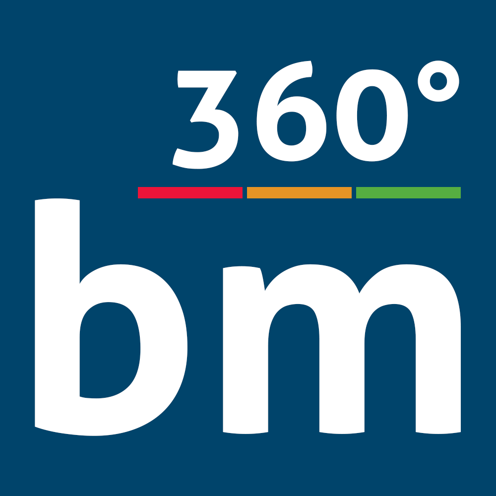

# BM-Street-View

## Über das Projekt

Das "360° bm StreetView Projekt" zielt darauf ab, eine interaktive, visuelle Darstellung unserer Schule zu schaffen. Durch die Nutzung von 360°-Fotografie ermöglichen wir es Betrachtern, virtuelle Rundgänge durch verschiedene Bereiche der Schule zu erleben. Dieses Projekt kombiniert technische Innovation mit kreativem Design, um eine einzigartige und immersive Erfahrung zu bieten.

## Hier live ansehen
Erlebe BM-Street-View live in Aktion! Besuche https://schoolview.thiemomentum.de, um einen virtuellen Rundgang durch unsere Schule in 360° zu starten.

## Features

* **360° Ansichten:** Nutze die 360°-Fotografie, um einen realistischen Eindruck unserer Schule zu vermitteln.
* **Interaktive Navigation:** Ermögliche Benutzern, sich frei im virtuellen Raum zu bewegen und verschiedene Bereiche zu erkunden.
* **Responsives Design:** Optimiert für verschiedene Gerätetypen und Bildschirmgrößen.

## Technologien

* JavaScript
* HTML
* CSS

## Voraussetzungen

Um das Projekt lokal auszuführen, benötigst du:

* Einen aktuellen Webbrowser
* Einen lokalen Server, um die HTML-Dateien zu hosten

## Installation

1. Klone das Repository: `git clone https://github.com/TravikSkoot/bm-street-view.git`
2. Öffne die HTML-Datei in deinem Webbrowser oder hoste sie auf deinem lokalen Server

## Nutzung

Navigiere in deinem Webbrowser zur index.html Datei des Projekts oder zur entsprechenden URL, wenn du das Projekt auf einem Server hostest. Nutze die Maus oder Touch-Eingaben, um dich in der 360°-Ansicht zu bewegen und die Schule zu erkunden.

## Mitwirken

Jeder Beitrag zu diesem Projekt ist willkommen. Folge diesen Schritten, um mitzuwirken:

1. Forke das Repository
2. Erstelle einen neuen Branch (`git checkout -b feature/AmazingFeature`)
3. Führe deine Änderungen durch (`git commit -m 'Add some AmazingFeature'`)
4. Push in den Branch (`git push origin feature/AmazingFeature`)
5. Öffne einen Pull Request

## Lizenz

Dieses Projekt ist unter der AGPL-3.0-Lizenz lizenziert - siehe die [LIZENZ](LICENSE.md) Datei für Details.

# Projektfortschritt - Projektwoche des bm Köln 2024

| Datum     | Erledigte Aufgaben                                                                                                                                                                                                                                     | Herausforderungen                                                                                                                                                            | Noch zu erledigen                                                                                                                                |
|-----------|--------------------------------------------------------------------------------------------------------------------------------------------------------------------------------------------------------------------------------------------------------|------------------------------------------------------------------------------------------------------------------------------------------------------------------------------|--------------------------------------------------------------------------------------------------------------------------------------------------|
| 15.01     | - Die Einrichtung und Justierung der 360° Kamera wurde erfolgreich abgeschlossen                                                                                                                                                                       | - Die aufgenommenen Bilder zeigten eine Überbelichtung| - Es muss eine vollständige Entwicklungsumgebung eingerichtet werden                                                                             |
| 16.01     | - Ein Großteil der 360°-Aufnahmen wurden gemacht| - Die Fotografie war durch zeitweise belegte Räume erschwert  - Die Findung des richtigen Frameworks gestaltete sich schwierig                                            | - Die Erstellung eines Grundgerüsts für die Darstellung der 360°-Ansichten steht noch aus                                                        |
| 17.01     | - Die Entwicklungsumgebung wurde erfolgreich aufgesetzt  - Das Basiskonzept für die 360°-Ansicht ist fertiggestellt  - Der erste Informationspunkt für die Aula wurde gesetzt                                                                  | - Die Festlegung einer Standardausrichtung für jedes einzelne Panoramabild musste bewältigt werden                                                                           | - Weitere Bilder und Navigationsbuttons sind dem Projekt hinzuzufügen                                                                            |
| 18.01     | - Die komplette Aula ist jetzt mit Hotspots/Infospots annotiert  - Die Standardausrichtung der Kamera bei Laden des ersten Panoramas wurde erfolgreich implementiert                                                                                | - Beim Versuch, den Namen des aktuellen Panoramas oben links in der Ecke anzuzeigen, gab es Probleme                                                                         | - Annotieren weiterer Räume durch Hinzufügen von Tags/Hotspots, um die Interaktivität und Informationsfülle des Streetview-Projekts zu erweitern |
| 22.01     | - Bereinigung des Repositories und Entfernung unnötiger Dateien   - Live-Schaltung der Website: [Schoolview Projekt](https://schoolview.thiemomentum.de/)   - Implementierung einer Fortschrittsanzeige für visuelles Feedback während des Ladens | - Keine größeren Probleme                                                                                                                                                    | - Hinzufügen zusätzlicher Hotspots für eine interaktive Navigationsführung                                                                                                     |
| 23.01     | - Fertigstellung aller geplanten Hotspots                                                                                                                                                                                                              | - Keine nennenswerten Probleme aufgetreten| - Bilder komprimieren für schnellere Ladezeit  - GUI für die verschiedenen Räume hinzufügen|
| 24.01     | - Optimierung der Bildergröße für schnelleres Laden der Website   - Hinzufügen einer grafischen Benutzeroberfläche (GUI) für die Navigation zwischen Räumen/Hotspots                                                                                | - Positionierung des GUI in der oberen rechten Ecke aufgrund von Einschränkungen der dot-gui-Bibliothek | - Zukunftspläne: Erweiterung um weitere Räume, Verbesserung der Kameraführung und Inszenierung der Räume|

## Kontakt

Projekt-Link: [https://github.com/TravikSkoot/bm-street-view](https://github.com/TravikSkoot/bm-street-view)
